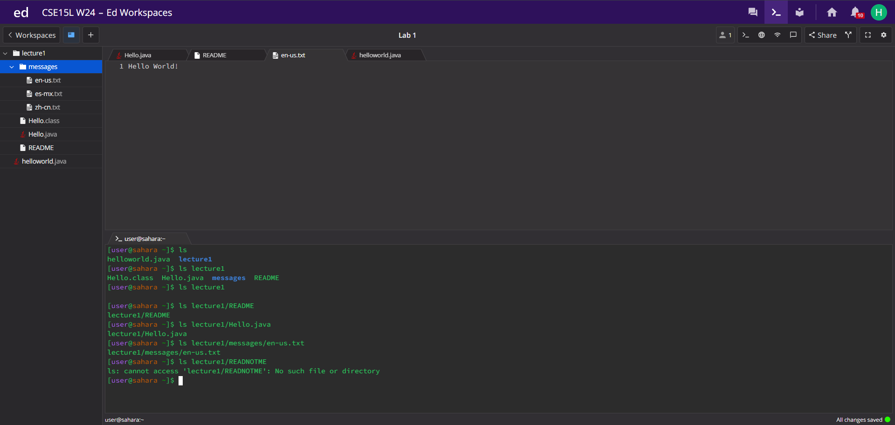
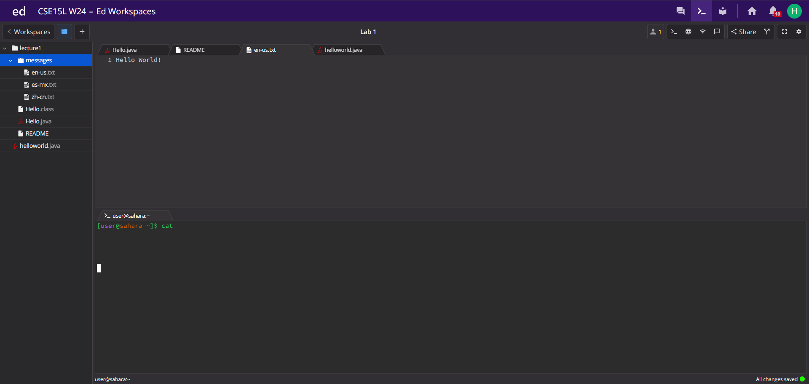

***##Lab Report 1***
***
Examples of cd:
1.Running with no argument will give home directory. In this case, it will not change the directory because it's already in the home directory. 
2.Running with a path argument such as lecture1 will change the directory into specific directory, in this case is the lecture1 directory. 
3.Running with a file argument will cause an error, because cd can be only used as directories. 

Examples of ls:
1. Running without argument will list the files and directories in the current directory. In this case, it will list Helloworld.java file and lecture1 directory.
2. Running with a path argument will list the files and directories in the specified directory. In this case, it will gives all the files and directories in lecture1.
3. Running with a file argument will list the file if it exist, and it will throw an error if the file does not exist. In this case, it will return the file if the file in lecture1 is existed, if not it will print an error.

Examples of cat:
1. Running with no argument will cause an error that it will wait for the input and respond nothing. In normal practice, cat method will usually use with argument. 
In this case, it will print an error. 
2. Running with a path argument will cause an error because cat is used for file not directory. In this case, it will print an error. 
3. Running with a file argument will display the content of specific file. In this case, it will print everything in the lecture1 of Hello.java. 
