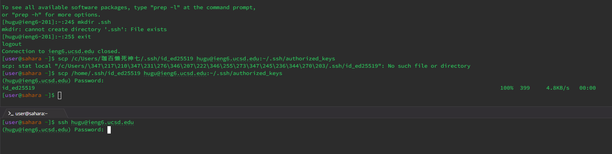
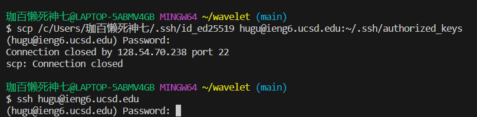
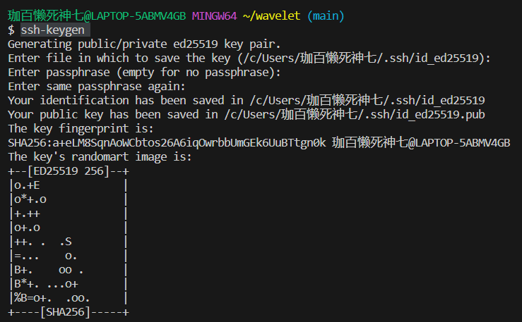

Part1:
Code: 

Screenshot 1: 

handleRequest(URI url) method of the Handler class is called. 
The argument to the handleRequest method is a URI object with the value http://localhost:2100/add-message?s=I%20don%27t%20know%20the%20password&user=wifi.
The relevant fields are chat for storing the chat history and user and message variables which are parsed from the query parameters. 
The chat string is appended with the new message formatted as user: message\n, which in this case would be wifi: I don't know the password\n.
The user variable takes the value wifi. The message variable takes the value I don't know the password.

Screenshot 2:

handleRequest(URI url) method of the Handler class is called.
The argument to the handleRequest method is a URI object with the value http://localhost:2100/add-message?s=hitshots&user=2B.
The relevant fields remain the same as in the first request: chat, user, and message.
The chat string has the new message appended, which would be 2B: hitshots\n.
The user variable takes the value 2B.
The message variable takes the value hitshots.

Part2:

1.  

2. 

3.  

Part3:

Well, it's a fun of learning that it's just the beginning of programming. In these two labs, I learned to set up servers and develop website. Although it's just the beginning of the course, I felt challenging about java and its coding. It's time to work hard on coding and start the assignments early. 
