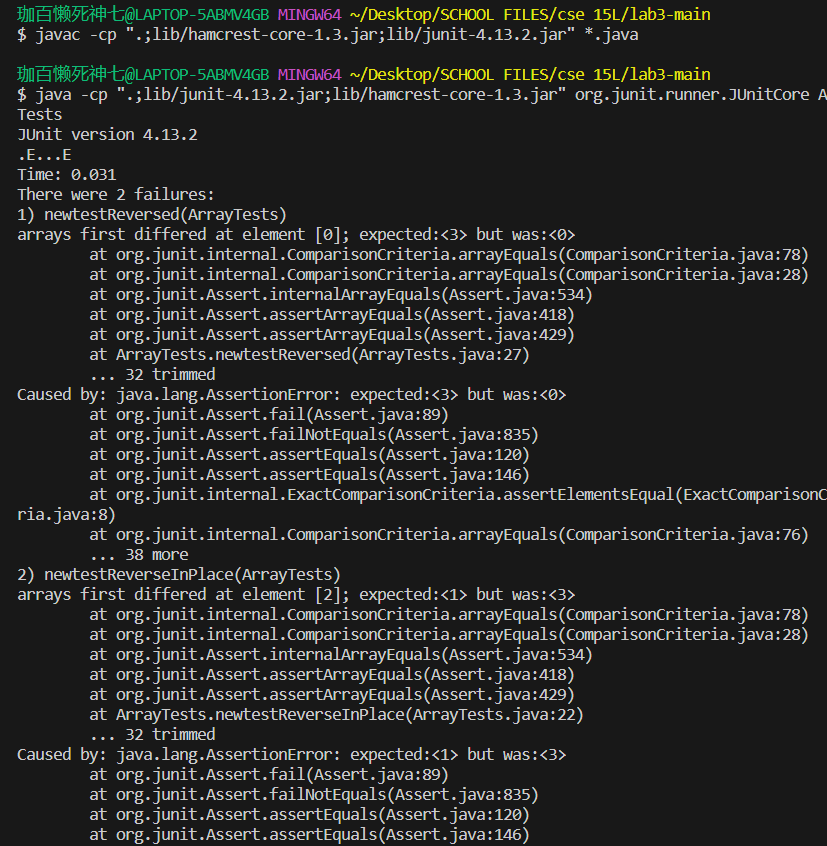
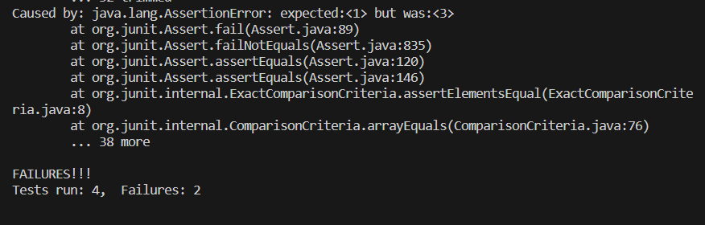
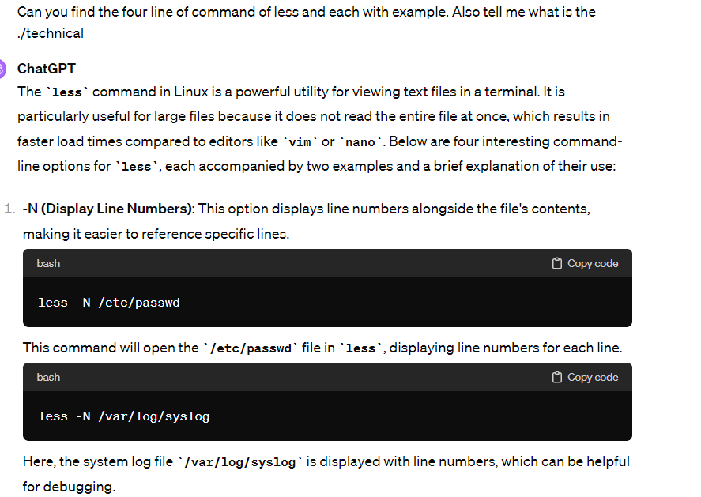
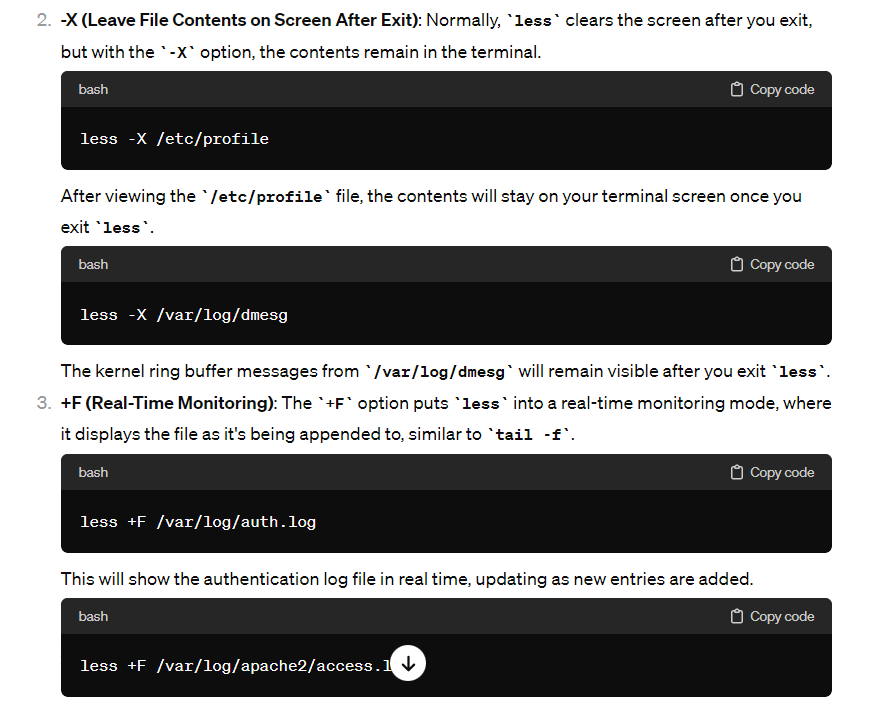
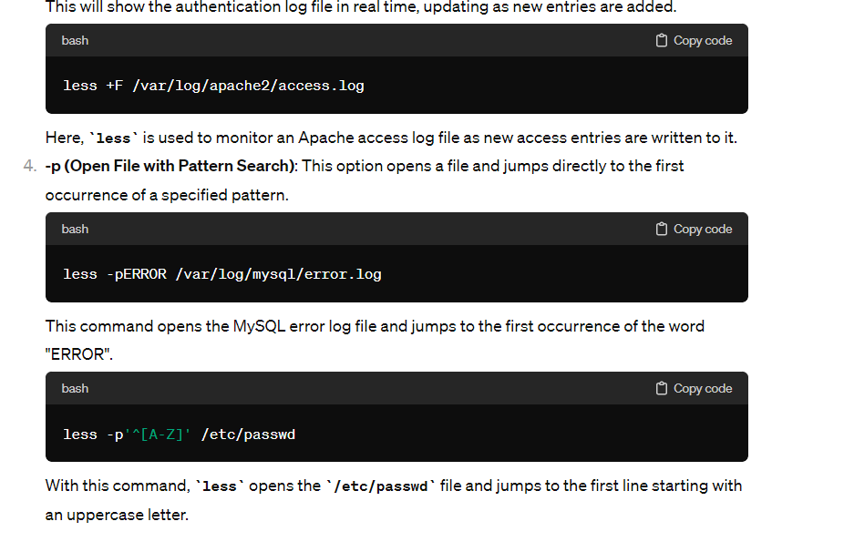

Part 1  
I choose the ArrayExample Method bugs from Lab 4. 

1. Test code cause the method to fail:
 ```
  @Test
  public void newtestReverseInPlace(){
    int[] input1 = {1,2,3};
    ArrayExamples.reverseInPlace(input1);
    assertArrayEquals(new int[]{3,2,1},input1);
  }
 @Test
  public void newtestReversed(){
    int[] input1 = {1,2,3};
    assertArrayEquals(new int[]{3,2,1},ArrayExamples.reversed(input1));
  }
``` 
  
2. Test code cause the method not fail: 
```
  @Test 
  public void testReverseInPlace() {
    int[] input1 = { 3 };
    ArrayExamples.reverseInPlace(input1);
    assertArrayEquals(new int[]{ 3 }, input1);
	}
  @Test
  public void testReversed() {
    int[] input1 = { };
    assertArrayEquals(new int[]{ }, ArrayExamples.reversed(input1));
  }
```  
3. Symptom:  
   
4. The Bug Before:

  
```
public class ArrayExamples {

  // Changes the input array to be in reversed order
  static void reverseInPlace(int[] arr) {
    for(int i = 0; i < arr.length; i += 1) {
      arr[i] = arr[arr.length - i - 1];
    }
  }

  // Returns a *new* array with all the elements of the input array in reversed
  // order
  static int[] reversed(int[] arr) {
    int[] newArray = new int[arr.length];
    for(int i = 0; i < arr.length; i += 1) {
      arr[i] = newArray[arr.length - i - 1];
    }
    return arr;
  }

  // Averages the numbers in the array (takes the mean), but leaves out the
  // lowest number when calculating. Returns 0 if there are no elements or just
  // 1 element in the array
  static double averageWithoutLowest(double[] arr) {
    if(arr.length < 2) { return 0.0; }
    double lowest = arr[0];
    for(double num: arr) {
      if(num < lowest) { lowest = num; }
    }
    double sum = 0;
    for(double num: arr) {
      if(num != lowest) { sum += num; }
    }
    return sum / (arr.length - 1);
  }


}
```
The Bug After:  
```
public class ArrayExamples {

  // Changes the input array to be in reversed order
  static void reverseInPlace(int[] arr) {
    for(int i = 0; i < arr.length/2; i += 1) {
      int temp = arr[i];
      arr[i] = arr[arr.length - i - 1];
      arr[arr.length - i - 1] = temp;
    }
  }

  // Returns a *new* array with all the elements of the input array in reversed
  // order
  static int[] reversed(int[] arr) {
    int[] newArray = new int[arr.length];
    for(int i = 0; i < arr.length; i += 1) {
      newArray[i] = arr[arr.length - i - 1];
    }
    return newArray;
  }

  // Averages the numbers in the array (takes the mean), but leaves out the
  // lowest number when calculating. Returns 0 if there are no elements or just
  // 1 element in the array
  static double averageWithoutLowest(double[] arr) {
    if(arr.length < 2) { return 0.0; }
    double lowest = arr[0];
    for(double num: arr) {
      if(num < lowest) { lowest = num; }
    }
    double sum = 0;
    for(double num: arr) {
      if(num != lowest) { sum += num; }
    }
    return sum / (arr.length - 1);
  }


}
```
  
**Bug Before:**   
Bug Explanation for `reverseInPlace`: The `reverseInPlace` method is intended to reverse the elements of an ArrayList.  
The method attempts to iterate over all elements and swap each with the corresponding element from the opposite end of the list (i.e., the element at index size - current index - 1).   
However, the loop incorrectly continues beyond the midpoint of the list, causing previously swapped elements to be overwritten.  
As a result, when the iteration reaches the last element, it is supposed to become the first, but the first element has already been swapped to the last position.   
This leads to a situation where, for example, the array {1, 2, 3} would be incorrectly modified to {3, 2, 3} instead of the expected {3, 2, 1}.  
Bug Explanation for `reversed`: The `reversed method` contains a bug within its for loop.   
The intention is to create a new array with elements in reverse order from the original array.   
However, the bug arises when the elements of the new array are incorrectly assigned to the original array,   
resulting in the original array being filled with default 0 values (since newArray is initialized but not yet populated).   
This mistake causes the original array to effectively become empty, while the new array remains unchanged.  
**Bug After:**  
Fixed Explanation for `reverseInPlace`:The correction is applied within the for loop, which now iterates from the first element (index 0) to the midpoint of the array.   
During each iteration, a temporary variable temp is used to store the element at the current index.   
This element is then swapped with the corresponding element from the end of the array (at index array length - current index - 1).   
With this modification, the input array {1, 2, 3} is correctly reversed to {3, 2, 1} through the swapping of elements at the first and last indices.  
Fixed Explanation for `reversed`: The fix involves adjusting the for loop to correctly assign the elements from the original array to the new array in reversed order.    
Instead of erroneously modifying the original array, the loop now populates the new array with the elements from the original array in reverse sequence.   
The method then returns this newly created reversed array. Consequently, for the input original array {1, 2, 3}, the method correctly returns a new array {3, 2, 1}.    

  
Part 2  
I choose `less`  
Command line: `-N`  
This command shows the number of line in the output of less

```
less -N ./technical/911report/chapter-1.txt
"WE HAVE SOME PLANES"
      5
      6     Tuesday, September 11, 2001, dawned temperate and nearly cloudless in the eastern       6 United States. Millions of men and women readied themselves for work. Some made their       6 way to the Twin Towers, the signature structures of the World Trade Center complex in       6 New York City. Others went to Arlington, Virginia, to the Pentagon. Across the Potomac      6  River, the United States Congress was back in session. At the other end of Pennsylvan      6 ia Avenue, people began to line up for a White House tour. In Sarasota, Florida, Presi
      6 dent George W. Bush went for an early morning run.
      7
      8     For those heading to an airport, weather conditions could not have been better for      8  a safe and pleasant journey. Among the travelers were Mohamed Atta and Abdul Aziz al 
      8 Omari, who arrived at the airport in Portland, Maine.
      9
     10 INSIDE THE FOUR FLIGHTS
     11
     12 Boarding the Flights
     13
     14     Boston: American 11 and United 175. Atta and Omari boarded a 6:00 A.M. flight from
     14  Portland to Boston's Logan International Airport.
     15
     16     When he checked in for his flight to Boston, Atta was selected by a computerized p     16 rescreening system known as CAPPS (Computer Assisted Passenger Prescreening System), c     16 reated to identify passengers who should be subject to special security measures. Unde     16 r security rules in place at the time, the only consequence of Atta's selection by CAP     16 PS was that his checked bags were held off the plane until it was confirmed that he ha
     16 d boarded the aircraft. This did not hinder Atta's plans.
     17
     18     Atta and Omari arrived in Boston at 6:45. Seven minutes later, Atta apparently too     18 k a call from Marwan al Shehhi, a longtime colleague who was at another terminal at Lo
     18 gan Airport. They spoke for three minutes.
     19
     20     It would be their final conversation.
     21
     22     Between 6:45 and 7:40, Atta and Omari, along with Satam al Suqami, Wail al Shehri,     22  and Waleed al Shehri, checked in and boarded American Airlines Flight 11, bound for L
     22 os Angeles. The flight was scheduled to depart at 7:45.
```

Explanation: The less command open the file in "chapter-1.txt" located in the 911report directory, which is helpful to see the lines number of Chapter 1 of 911 report. 
  
```
less -N ./technical/biomed/1468-6708-3-1.txt
      5         Introduction
      6         Older adults are frequently counseled to lose weight,
      7         even though there is little evidence that overweight is
      8         associated with increased mortality in those over age 65.
      9         Six large controlled population-based studies of
     10         non-smoking older adults have investigated the association
     11         between body mass index (BMI) and mortality, controlling
     12         for relevant covariates [ 1 2 3 4 5 6 ] . All studies found
     13         excess risk for persons with very low BMI, but that persons
     14         with moderately high BMI had little or no extra risk except
     15         in certain small subsets. A review of 13 studies of older
     16         adults drew similar conclusions [ 7 ] .
     17         Many healthy older adults report gradual weight gain
     18         throughout adult life. It may be that a small amount of
     19         gradual weight gain is normative and associated with the
     20         most robust health as we age. It has been suggested that
     21         weight standards be adjusted upwards for age [ 8 ] . Such
     22         recommendations remain controversial, however, because the
     23         number of studies of older persons is fairly small, and
     24         because few studies have examined the relation of BMI to
     25         quality of life or years of healthy life (YHL) in the
     26         elderly [ 9 ] .
     27         In older adults, risk factors may have a greater effect
     28         on health than on mortality. If so, then behavior change
     29         trials of weight modification might be more successful if
     30         they were evaluated on improved health, rather than on
     31         decreased mortality. Clinical trials powered to detect
     32         differences in YHL would often require fewer subjects than
     33         trials to detect survival differences or cardiovascular
     34         events [ 10 ] . In this paper we study whether BMI at
     35         baseline is associated with living longer, and/or with more
     36         years of being healthy, in a cohort of older adults for
     37         whom risk factors, subclinical disease, and morbidity are
     38         well characterized. The goal is to determine whether
     39         analyses based on years of life (YOL) or on YHL would
     40         provide substantively different results, and which measure
     41         would yield more powerful evaluations of weight
```

Explanation:The less command open the file in "1468-6708-3-1.txt" located in the biomed directory, which is helpful to see the lines number of 1468-6708-3-1 of 911 biomed.   
  
Command line: `-X`  
This command allows content remain on the terminal when less is exit

  
```
less -X ./technical/911report/chapter-1.txt
"WE HAVE SOME PLANES"

    Tuesday, September 11, 2001, dawned temperate and nearly cloudless in the eastern United States. Millions of men and women readied themselves for work. Some made their way to the Twin Towers, the signature structures of the World Trade Center complex in New York City. Others went to Arlington, Virginia, to the Pentagon. Across the Potomac River, the United States Congress was back in session. At the other end of Pennsylvania Avenue, people began to line up for a White House tour. In Sarasota, Florida, President George W. Bush went for an early morning run.

    For those heading to an airport, weather conditions could not have been better for a safe and pleasant journey. Among the travelers were Mohamed Atta and Abdul Aziz al Omari, who arrived at the airport in Portland, Maine.

INSIDE THE FOUR FLIGHTS

Boarding the Flights

    Boston: American 11 and United 175. Atta and Omari boarded a 6:00 A.M. flight from Portland to Boston's Logan International Airport.

    When he checked in for his flight to Boston, Atta was selected by a computerized prescreening system known as CAPPS (Computer Assisted Passenger Prescreening System), created to identify passengers who should be subject to special security measures. Under security rules in place at the time, the only consequence of Atta's selection by CAPPS was that his checked bags were held off the plane until it was confirmed that he had boarded the aircraft. This did not hinder Atta's plans.

    Atta and Omari arrived in Boston at 6:45. Seven minutes later, Atta apparently took a call from Marwan al Shehhi, a longtime colleague who was at another terminal at Logan Airport. They spoke for three minutes.

    It would be their final conversation.

    Between 6:45 and 7:40, Atta and Omari, along with Satam al Suqami, Wail al Shehri, and Waleed al Shehri, checked in and boarded American Airlines Flight 11, bound for Los Angeles. The flight was scheduled to depart at 7:45.
```

Explanation: The command makes the content of Chapter 1 of 911 report still on the terminal, which is useful when want to use the terminal and also read the content of 911 report Chapter 1
  

```
less -X ./technical/biomed/1468-6708-3-1.txt


        Introduction
        Older adults are frequently counseled to lose weight,
        even though there is little evidence that overweight is
        associated with increased mortality in those over age 65.
        Six large controlled population-based studies of
        non-smoking older adults have investigated the association
        between body mass index (BMI) and mortality, controlling
        for relevant covariates [ 1 2 3 4 5 6 ] . All studies found
        excess risk for persons with very low BMI, but that persons
        with moderately high BMI had little or no extra risk except
        in certain small subsets. A review of 13 studies of older
        adults drew similar conclusions [ 7 ] .
        Many healthy older adults report gradual weight gain
        throughout adult life. It may be that a small amount of
        gradual weight gain is normative and associated with the
        most robust health as we age. It has been suggested that
        weight standards be adjusted upwards for age [ 8 ] . Such
        recommendations remain controversial, however, because the
        number of studies of older persons is fairly small, and
        because few studies have examined the relation of BMI to
        quality of life or years of healthy life (YHL) in the
        elderly [ 9 ] .
        In older adults, risk factors may have a greater effect
        on health than on mortality. If so, then behavior change
        trials of weight modification might be more successful if
        they were evaluated on improved health, rather than on
        decreased mortality. Clinical trials powered to detect
        differences in YHL would often require fewer subjects than
        trials to detect survival differences or cardiovascular
        events [ 10 ] . In this paper we study whether BMI at
        baseline is associated with living longer, and/or with more
        years of being healthy, in a cohort of older adults for
        whom risk factors, subclinical disease, and morbidity are
        well characterized. The goal is to determine whether
        analyses based on years of life (YOL) or on YHL would
        provide substantively different results, and which measure
        would yield more powerful evaluations of weight
```
  
Explanation: The command makes the content of 1468-6708-3-1 of biomed still on the terminal, which is useful when want to use the terminal and also read the content of biomed 1468-6708-3-1.   

  
Command Line: `+F`
This command is for see the real time update of the file, it will display the end of the file.   

```
less +F ./technical/biomed/1468-6708-3-1.txt
YOL would likely be even greater than that shown here.
          These more sensitive measures might also have detected
          differences between the overweight and normal weight
          persons, but we think this is unlikely given the absence
          of any differences in EVGFP.


        Conclusion
        Recommendations for desirable weight have been
        criticized for emphasizing mortality rather than health. We
        found associations between YHL and obesity that were not
        present in the mortality analysis, suggesting that YHL may
        be a more sensitive measure of the burden of obesity in
        older adults, especially for women. Future efforts to
        determine desirable weight guidelines should include
        measures of YHL. Using either YOL or YHL, however, we found
        no excess risk for older adults who would be classified as
        'overweight' by the NHLBI guidelines. This suggests using
        YHL as the outcome measure in clinical trials involving
        obese or underweight older adults, and discouraging trials
        that address older adults who are merely overweight.


        Competing interests
        None declared


        Abbreviations
        BMI Body mass index
        CESD Center for Epidemiologic Studies Depression
        Scale
        CHS Cardiovascular Health Study
        EVGFP Is your health excellent, very good, good, fair or
        poor?
        QALY Quality-adjusted life years
        YHL Years of healthy life
        YOL Years of life


Waiting for data... (^X or interrupt to abort)
```

Explanation: The command send 1468-6708-3-1 to the end for the real time update, but since there is no one modify the data, it will repeat waiting for data until some do ^X and quit. It's useful for real time monitering data of a file. 

  
```
less +F ./technical/911report/chapter-1.txt


        Introduction
        Older adults are frequently counseled to lose weight,

lead pilot explained, "I reverted to the Russian threat. . . . I'm thinking cruise missile threat from the sea. You know you look down and see the Pentagon burning and I thought the bastards snuck one by us. . . . [Y]ou couldn't see any airplanes, and no one told us anything." The pilots knew their mission was to divert aircraft, but did not know that the threat came from hijacked airliners.

    Second, NEADS did not have accurate information on the location of United 93. Presumably FAA would have provided such information, but we do not know how long that would have taken, nor how long it would have taken NEADS to locate the target.

    Third, NEADS needed orders to pass to the pilots. At 10:10, the pilots over Washington were emphatically told, "negative clearance to shoot." Shootdown authority was first communicated to NEADS at 10:31. It is possible that NORAD commanders would have ordered a shootdown in the absence of the authorization communicated by the Vice President, but given the gravity of the decision to shoot down a commercial airliner, and NORAD's caution that a mistake not be made, we view this possibility as unlikely.

    NORAD officials have maintained that they would have intercepted and shot down United 93. We are not so sure. We are sure that the nation owes a debt to the passengers of United 93. Their actions saved the lives of countless others, and may have saved either the Capitol or the White House from destruction.

    The details of what happened on the morning of September 11 are complex, but they play out a simple theme. NORAD and the FAA were unprepared for the type of attacks launched against the United States on September 11, 2001. They struggled, under difficult circumstances, to improvise a homeland defense against an unprecedented challenge they had never before encountered and had never trained to meet.

    At 10:02 that morning, an assistant to the mission crew commander at NORAD's Northeast Air Defense Sector in Rome, New York, was working with his colleagues on the floor of the command center. In a brief moment of reflection, he was recorded remarking that "This is a new type of war."

    He was, and is, right. But the conflict did not begin on 9/11. It had been publicly declared years earlier, most notably in a declaration faxed early in 1998 to an Arabic-language newspaper in London. Few Americans had noticed it. The fax had been sent from thousands of miles away by the followers of a Saudi exile gathered in one of the most remote and impoverished countries on earth.


Waiting for data... (^X or interrupt to abort)
```

Explanation: The command send chapter-1 to the end for the real time update, but since there is no one modify the data, it will repeat waiting for data until some do ^X and quit. It's useful for real time monitering data of a file. 

  
Command Line: `-p`
This command is for search a specific pattern and jump to the first appear.   

```
less -pError ./technical/911report/chapter-1.txt
Pattern not found  (press RETURN)
```

Explanation: The command is use for search word 'Error' in the chapter-1.txt, but since there is no word 'Error' in there, it return pattern not found. It's useful when search first 'Error' in a file.  

  
```
less -p'^[A-Z]' ./technical/911report/chapter-1.txt
INSIDE THE FOUR FLIGHTS

Boarding the Flights

    Boston: American 11 and United 175. Atta and Omari boarded a 6:00 A.M. flight from Portland to Boston's Logan International Airport.

    When he checked in for his flight to Boston, Atta was selected by a computerized prescreening system known as CAPPS (Computer Assisted Passenger Prescreening System), created to identify passengers who should be subject to special security measures. Under security rules in place at the time, the only consequence of Atta's selection by CAPPS was that his checked bags were held off the plane until it was confirmed that he had boarded the aircraft. This did not hinder Atta's plans.

    Atta and Omari arrived in Boston at 6:45. Seven minutes later, Atta apparently took a call from Marwan al Shehhi, a longtime colleague who was at another terminal at Logan Airport. They spoke for three minutes.

    It would be their final conversation.

    Between 6:45 and 7:40, Atta and Omari, along with Satam al Suqami, Wail al Shehri, and Waleed al Shehri, checked in and boarded American Airlines Flight 11, bound for Los Angeles. The flight was scheduled to depart at 7:45.

    In another Logan terminal, Shehhi, joined by Fayez Banihammad, Mohand al Shehri, Ahmed al Ghamdi, and Hamza al Ghamdi, checked in for United Airlines Flight 175, also bound for Los Angeles. A couple of Shehhi's colleagues were obviously unused to travel; according to the United ticket agent, they had trouble understanding the standard security questions, and she had to go over them slowly until they gave the routine, reassuring answers.

    Their flight was scheduled to depart at 8:00.

    The security checkpoints through which passengers, including Atta and his colleagues, gained access to the American 11 gate were operated by Globe Security under a contract with American Airlines. In a different terminal, the single checkpoint through which passengers for United 175 passed was controlled by United Airlines, which had contracted with Huntleigh USA to perform the screening.

    In passing through these checkpoints, each of the hijackers would have been screened by a walk-through metal detector calibrated to detect items with at least the metal content of a .22-caliber handgun. Anyone who might have set off that detector would have been screened with a./technical/911report/chapter-1.txt
```

Explanation: This command opens chapter-1.txt and search for the first line starting with an uppercase letter, which is "INSIDE THE FOUR FLIGHTS". This is useful to search first uppercase letter in a file  
Sources:  



