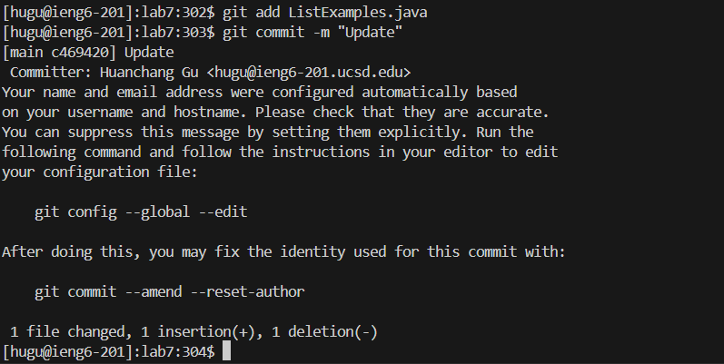
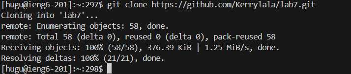
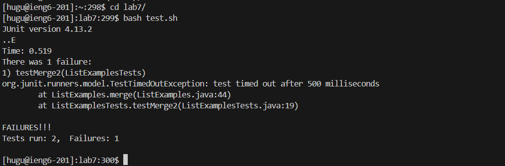
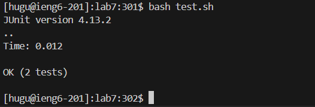

**Lab Report 4 - Huanchang Gu A17122477**   
--  

**Step 4**  
--  
    
Explanation: First, I logged in my `ieng6-201` account using ssh.  
Key Pressed: `ssh <space> hugu@ieng6-201.ucsd.edu <enter>`  

**Step 5**  
--  
   
Explanation: Then, I copy the `SSH URL https://github.com/Kerrylala/lab7.git` to clipboard from the github repository  
by pressing `copy url to clipboard` command. Then, I cloned it with SSH.  
Key Pressed: `git <space> clone <space> <Command + V> <enter>`

**Step 6**  
-- 
   
Explanation: After changing the respository to `lab7` using `cd`, I ran the test and they all failed one.  
I used `<tab>` to help me fill the rest of the respository/file name l for lab7, t for test.sh  
Key Pressed: `cd <space> l <tab> <enter> , and then bash <space> t <tab> <enter>`  

**Step 7**  
--  
   
   
Explanation: I opened the `vim` text editor to check and fix the error in the file, and here I also used   
`<tab>` after L and added `.java` to complete the `ListExample.java` file name. The instruction said   
I need to change `index1` into `index2` on the indicated line. Therefore, I used the find command by   
pressing `/index1` and `enter` to find the first `index1` occurrence and used 8 times of `n` to find   
the `index1` I needed. Then I pressed `e` to jump to the last character in the `index1`, and `r` and   
`2` to open the replace mode and replace the last character `1` to `2`. Afterall, I pressed `<Esc>` to   
go back to normal mode and pressed `:wq!` to save and quit the file.    
Key Pressed: `vim <space> <Shift + l> <tab> .java <enter>`     
Key Pressed(vim): `/index1 <enter> n n n n n n n n n e r 2 <Esc> <Shift +;> wq! <enter>`  

**Step 8** 
--  
   
Explanation: After fixed the code, I reran the tests and found out they all passed. Again, I pressed  
  <tab> helps me fill in the rest of test.sh.  
  
**Step 9**   
--    
   
Explanation: Finally, I first used git add the `ListExample.java` file to stage changes for the next  
commit, then I used git commit to commit and pushed my staged changes with -m to include my commit message "Update"  
Key Pressed: `git <space> add <space> <Shift + l> <tab> .java <enter> , and then
git <space> commit <space> -m <space> <Shift + '> <Shift + U>pdate <Shift + '>
<enter> , and lastly git <space> push <space> origin <space> main <enter>`

