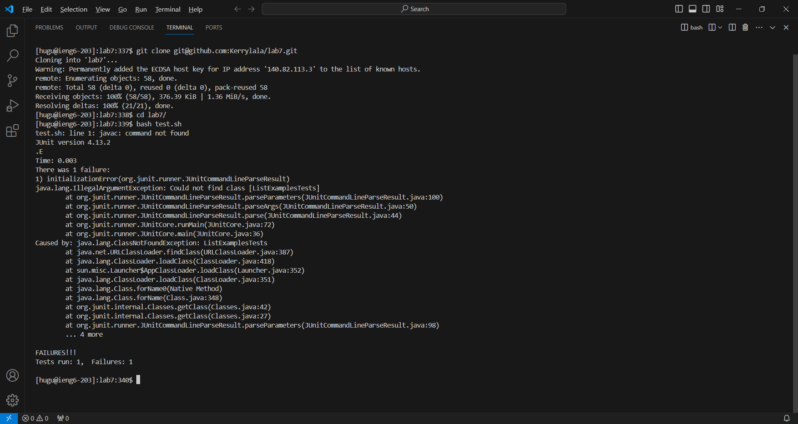
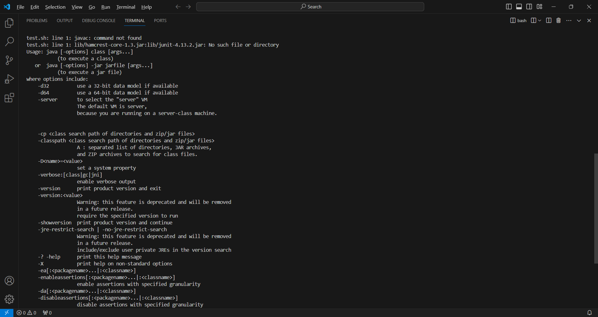
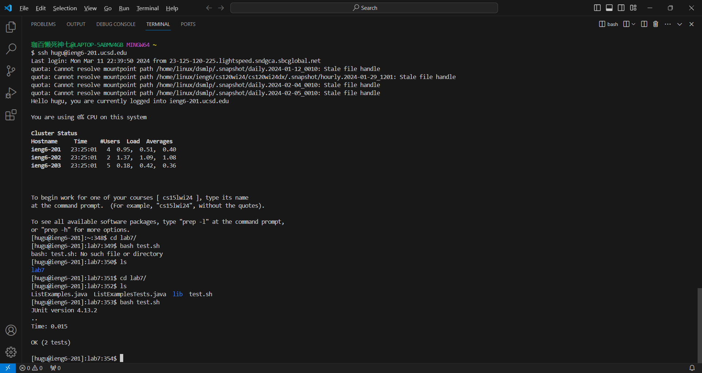

**Lab Report 5 Huanchang Gu A17122477**
--    

**Step 1**  
**Student post**    
--  
  
  
  
Hi, I am trying to finish lab4. Therefore, I logged in my ieng6-203 with  
`ssh hugu@ieng6-203.ucsd.edu` and clone the repository that forked. Then I `cd` the path to lab7.         
However,when I tried to run the test with `bash test.sh`, it said initialization error.     
At first, I thought it's the  error that come with the ListExample.java,   
so I changed the `index1` to     
`index2`, but I found out that it's not the problem. Then I checked the   
`test.sh` code, by changing the code of `:` from mac to `;` from windows,   
there are more errors received. I think it's caused by the incorrect version of  
junit, but still I don't know how to correct it.   

**Response from TA**
--  

Hey there!  

Thanks for reaching out. It looks like you're on the right track with your testing and debugging efforts.   
However, the issue you're encountering might be due to the environment you're logged into.   
You mentioned you logged into ieng6-203, but based on the context of your lab, it seems that you should be working on ieng6-201. 
Sometimes, such environmental differences can lead to discrepancies in behavior, 
especially if the setup or configurations differ between the two environments.   
This could potentially explain the initialization error you're seeing. Here’s what you can do:  
1. Log out from ieng6-203 by typing exit or closing the terminal.  
2. Log in to the correct environment using ssh yourusername@ieng6-201.ucsd.edu.  
Once logged in, navigate to your lab directory and try running the tests again with bash test.sh.    
3. By logging into the correct environment, the versions of tools and libraries should be as expected for        
your lab work, which might resolve the errors you're encountering.  
Hope this helps!

Best,
TA  

**Error Resolved by the student**  
-- 

  
Thank you, TA! I after switch to the ieng6-201, the `bash test.sh` is working as expected  and
the test compiles. Switching to ieng6-201 and rerunning `bash test.sh`,  
I no longer get the initialization error. The issue was indeed due to being on the wrong server.  

**Step 2**
--
After the CSE 15L course, one thing I found that is super exciting is the editing github file on  
a remote servesr, especially the `vim` text editor and `git add, commit, push` command. With these command,  
I could make changes to my GitHub repository from any terminal with SSH access. It's like a game-changing   
perspective to my view of code. 

